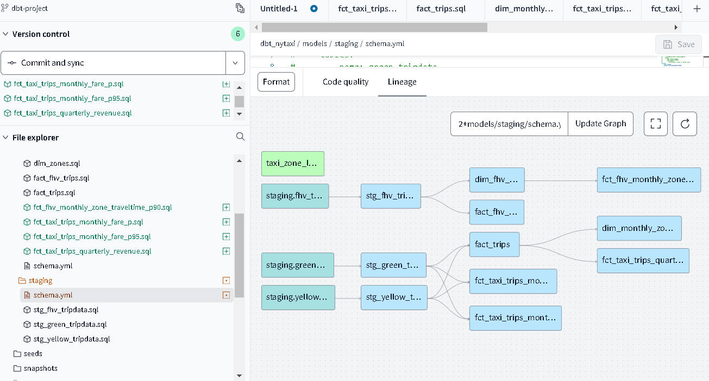
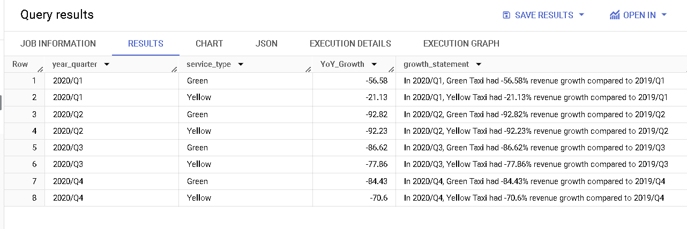
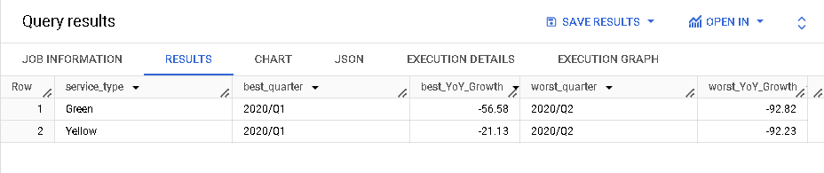
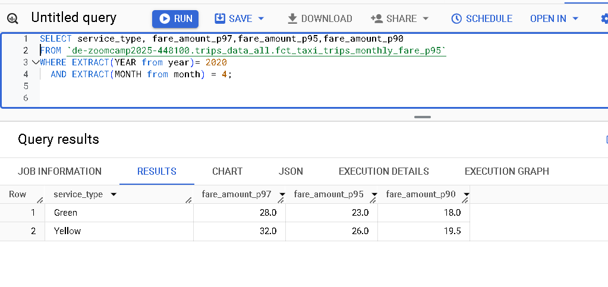
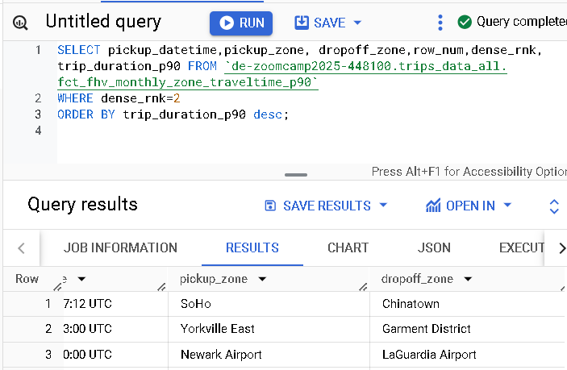

## Homework 4: Analytics Engineering for Data Engineering Zoomcamp 2025

### For Homework for 2025  we ensured the total records in each table:

1. We had exactly `7,778,101` records in your Green Taxi table
2. We had exactly `109,047,518` records in your Yellow Taxi table
3. We had exactly `43,244,696` records in your FHV table
   
### Additional dbt Project models/fact tables were generated for homework


# Homework Questions

### Question 1: Understanding dbt model resolution

Provided you've got the following sources.yaml
```yaml
version: 2

sources:
  - name: raw_nyc_tripdata
    database: "{{ env_var('DBT_BIGQUERY_PROJECT', 'dtc_zoomcamp_2025') }}"
    schema:   "{{ env_var('DBT_BIGQUERY_SOURCE_DATASET', 'raw_nyc_tripdata') }}"
    tables:
      - name: ext_green_taxi
      - name: ext_yellow_taxi
```

with the following env variables setup where `dbt` runs:
```shell
export DBT_BIGQUERY_PROJECT=myproject
export DBT_BIGQUERY_DATASET=my_nyc_tripdata
```

What does this .sql model compile to?
```sql
select * 
from {{ source('raw_nyc_tripdata', 'ext_green_taxi' ) }}
```

- `select * from dtc_zoomcamp_2025.raw_nyc_tripdata.ext_green_taxi`
- `select * from dtc_zoomcamp_2025.my_nyc_tripdata.ext_green_taxi`
- `select * from myproject.raw_nyc_tripdata.ext_green_taxi`
- `select * from myproject.my_nyc_tripdata.ext_green_taxi`
- `select * from dtc_zoomcamp_2025.raw_nyc_tripdata.green_taxi`

### Answer:  `select * from myproject.my_nyc_tripdata.ext_green_taxi`
* Explaination:* 
  - export DBT_BIGQUERY_PROJECT=myproject: This sets the environment variable DBT_BIGQUERY_PROJECT to myproject.
  - export DBT_BIGQUERY_DATASET=my_nyc_tripdata: This sets the environment variable DBT_BIGQUERY_SOURCE_DATASET to   my_nyc_tripdata.
Therefore, Given the environment variable setup, the database will resolve to myproject and the schema will resolve to my_nyc_tripdata.

### Question 2: dbt Variables & Dynamic Models

Say you have to modify the following dbt_model (`fct_recent_taxi_trips.sql`) to enable Analytics Engineers to dynamically control the date range. 

- In development, you want to process only **the last 7 days of trips**
- In production, you need to process **the last 30 days** for analytics

```sql
select *
from {{ ref('fact_taxi_trips') }}
where pickup_datetime >= CURRENT_DATE - INTERVAL '30' DAY
```

What would you change to accomplish that in a such way that command line arguments takes precedence over ENV_VARs, which takes precedence over DEFAULT value?

- Add `ORDER BY pickup_datetime DESC` and `LIMIT {{ var("days_back", 30) }}`
- Update the WHERE clause to `pickup_datetime >= CURRENT_DATE - INTERVAL '{{ var("days_back", 30) }}' DAY`
- Update the WHERE clause to `pickup_datetime >= CURRENT_DATE - INTERVAL '{{ env_var("DAYS_BACK", "30") }}' DAY`
- Update the WHERE clause to `pickup_datetime >= CURRENT_DATE - INTERVAL '{{ var("days_back", env_var("DAYS_BACK", "30")) }}' DAY`
- Update the WHERE clause to `pickup_datetime >= CURRENT_DATE - INTERVAL '{{ env_var("DAYS_BACK", var("days_back", "30")) }}' DAY`

### Answer: - Update the WHERE clause to `pickup_datetime >= CURRENT_DATE - INTERVAL '{{ var("days_back", env_var("DAYS_BACK", "30")) }}' DAY`
* Explaination: 
  - The var function retrieves the value of the days_back variable if it is passed as a command line argument.
  - var("days_back") ensures that if a command line argument is provided, it takes precedence.
  - env_var("DAYS_BACK", "30") retrieves the value of the DAYS_BACK environment variable. If the environment variable is not    set, it defaults to "30".
  - By placing env_var("DAYS_BACK", "30") inside the var function, we ensure that the environment variable takes precedence over the default value.
  - If neither the command line argument nor the environment variable is provided, the default value of "30" days is used.

### Question 3: dbt Data Lineage and Execution

Considering the data lineage below **and** that taxi_zone_lookup is the **only** materialization build (from a .csv seed file):


Select the option that does **NOT** apply for materializing `fct_taxi_monthly_zone_revenue`:

- `dbt run`
- `dbt run --select +models/core/dim_taxi_trips.sql+ --target prod`
- `dbt run --select +models/core/fct_taxi_monthly_zone_revenue.sql`
- `dbt run --select +models/core/`
- `dbt run --select models/staging/+`

### Answer:`dbt run --select models/staging/+`
This command will only runs models in the staging directory and their dependents. It does not include dim_taxi_trips or fct_taxi_monthly_zone_revenue directly unless they are part of the staging directory’s dependencies. 

### Question 4: dbt Macros and Jinja

Consider you're dealing with sensitive data (e.g.: [PII](https://en.wikipedia.org/wiki/Personal_data)), that is **only available to your team and very selected few individuals**, in the `raw layer` of your DWH (e.g: a specific BigQuery dataset or PostgreSQL schema), 

 - Among other things, you decide to obfuscate/masquerade that data through your staging models, and make it available in a different schema (a `staging layer`) for other Data/Analytics Engineers to explore

- And **optionally**, yet  another layer (`service layer`), where you'll build your dimension (`dim_`) and fact (`fct_`) tables (assuming the [Star Schema dimensional modeling](https://www.databricks.com/glossary/star-schema)) for Dashboarding and for Tech Product Owners/Managers

You decide to make a macro to wrap a logic around it:

```sql


    
    

     {{- env_var(target_env_var) -}}
                        {{- env_var(stging_env_var, env_var(target_env_var)) -}}
    


```

And use on your staging, dim_ and fact_ models as:
```sql
{{ config(
    schema=resolve_schema_for('core'), 
) }}
```

That all being said, regarding macro above, **select all statements that are true to the models using it**:
- Setting a value for  `DBT_BIGQUERY_TARGET_DATASET` env var is mandatory, or it'll fail to compile
- Setting a value for `DBT_BIGQUERY_STAGING_DATASET` env var is mandatory, or it'll fail to compile
- When using `core`, it materializes in the dataset defined in `DBT_BIGQUERY_TARGET_DATASET`
- When using `stg`, it materializes in the dataset defined in `DBT_BIGQUERY_STAGING_DATASET`, or defaults to `DBT_BIGQUERY_TARGET_DATASET`
- When using `staging`, it materializes in the dataset defined in `DBT_BIGQUERY_STAGING_DATASET`, or defaults to `DBT_BIGQUERY_TARGET_DATASET`

### Answer:  True statement models are: 
  - Setting a value for  `DBT_BIGQUERY_TARGET_DATASET` env var is mandatory, or it'll fail to compile
  - When using `core`, it materializes in the dataset defined in `DBT_BIGQUERY_TARGET_DATASET`
  - When using `stg`, it materializes in the dataset defined in `DBT_BIGQUERY_STAGING_DATASET`, or defaults to `DBT_BIGQUERY_TARGET_DATASET`
  - When using `staging`, it materializes in the dataset defined in `DBT_BIGQUERY_STAGING_DATASET`, or defaults to `DBT_BIGQUERY_TARGET_DATASET`

* Since the macro explicitly sets the dataset to DBT_BIGQUERY_TARGET_DATASET if the model_type is 'core', it will fail if this environment variable is not defined. However, for model_type other than 'core', the dataset will default to DBT_BIGQUERY_STAGING_DATASET if defined, or fall back to DBT_BIGQUERY_TARGET_DATASET.

## Serious SQL

We added some new dimensions `year` (e.g.: 2019, 2020), `quarter` (1, 2, 3, 4), `year_quarter` (e.g.: `2019/Q1`, `2019-Q2`), and `month` (e.g.: 1, 2, ..., 12), **extracted from pickup_datetime**, to your `fct_taxi_trips` OR `dim_taxi_trips.sql` models to facilitate filtering our queries

### Question 5: Taxi Quarterly Revenue Growth

1. Create a new model `fct_taxi_trips_quarterly_revenue.sql`
2. Compute the Quarterly Revenues for each year for based on `total_amount`
3. Compute the Quarterly YoY (Year-over-Year) revenue growth 
  * e.g.: In 2020/Q1, Green Taxi had -12.34% revenue growth compared to 2019/Q1
  * e.g.: In 2020/Q4, Yellow Taxi had +34.56% revenue growth compared to 2019/Q4

### New model `fct_taxi_trips_quarterly_revenue.sql` created in dbt_nytaxi/models/core/fct_taxi_trips_quarterly_revenue.sql
```
{{
    config(
        materialized='table'
    )
}}

with trips_data as (
    select * from {{ ref('fact_trips') }}
)
select 
    -- Revenue grouping 
    pickup_zone as revenue_zone,
    FORMAT_TIMESTAMP('%Y-%m-%dT%H:%M:%S+00:00', pickup_datetime) as formatted_pickup_datetime,
    date_trunc(pickup_datetime, quarter) as revenue_quarter, 
    service_type, 
    -- New dimensions
    extract(year FROM pickup_datetime) AS year,
    extract(quarter FROM pickup_datetime) AS quarter,
    CONCAT(CAST(extract(year FROM pickup_datetime) AS STRING), '/Q', CAST(extract(quarter FROM pickup_datetime) AS STRING)) AS year_quarter,
    extract(month FROM pickup_datetime) AS month,
    -- Revenue calculation 
    sum(fare_amount) as revenue_quarterly_fare,
    sum(extra) as revenue_quarterly_extra,
    sum(mta_tax) as revenue_quarterly_mta_tax,
    sum(tip_amount) as revenue_quarterly_tip_amount,
    sum(tolls_amount) as revenue_quarterly_tolls_amount,
    sum(ehail_fee) as revenue_quarterly_ehail_fee,
    sum(improvement_surcharge) as revenue_quarterly_improvement_surcharge,
    sum(total_amount) as revenue_quarterly_total_amount,
    -- Additional calculations
    count(tripid) as total_quarterly_trips,
    avg(passenger_count) as avg_quarterly_passenger_count,
    avg(trip_distance) as avg_quarterly_trip_distance
from 
    trips_data
group by 
    revenue_zone,
    formatted_pickup_datetime,
    revenue_quarter,
    service_type,
    year,
    quarter,
    year_quarter,
    month
```
### Compute the Quarterly YoY (Year-over-Year) revenue growth 
  * e.g.: In 2020/Q1, Green Taxi had -12.34% revenue growth compared to 2019/Q1

```
WITH quarterly_revenue AS (
    SELECT 
        year_quarter,
        year,
        quarter,
        service_type,
        SUM(revenue_quarterly_total_amount) AS agg_total_amount
    FROM 
        `de-zoomcamp2025-448100.trips_data_all.fct_taxi_trips_quarterly_revenue`
    GROUP BY 
        year_quarter, year, quarter, service_type
),
revenue_growth AS (
    SELECT 
        latest_year.year_quarter,
        latest_year.service_type,
        latest_year.quarter,
        latest_year.agg_total_amount AS revenue_2020, 
        previous_year.agg_total_amount AS revenue_2019, 
        ((latest_year.agg_total_amount - previous_year.agg_total_amount) / previous_year.agg_total_amount) * 100 AS YoY_Growth
    FROM 
        quarterly_revenue AS latest_year
    JOIN 
        quarterly_revenue AS previous_year
    ON 
        latest_year.quarter = previous_year.quarter
    AND 
        latest_year.service_type = previous_year.service_type
    AND 
        latest_year.year = 2020
    AND 
        previous_year.year = 2019
)
SELECT 
    year_quarter,
    service_type,
    ROUND(YoY_Growth, 2) AS YoY_Growth,
    CASE 
        WHEN YoY_Growth >= 0 THEN CONCAT('In ', year_quarter, ', ', service_type, ' Taxi had +', ROUND(YoY_Growth, 2), '% revenue growth compared to 2019/Q', quarter)
        ELSE CONCAT('In ', year_quarter, ', ', service_type, ' Taxi had ', ROUND(YoY_Growth, 2), '% revenue growth compared to 2019/Q', quarter)
    END AS growth_statement
FROM 
    revenue_growth
ORDER BY 
    year_quarter, service_type;
```


### Compute the Quarterly YoY (Year-over-Year) revenue growth 
  * e.g.: In 2020/Q1, Green Taxi had -12.34% revenue growth compared to 2019/Q1
  * e.g.: In 2020/Q4, Yellow Taxi had +34.56% revenue growth compared to 2019/Q4
```
WITH quarterly_revenue AS (
    SELECT 
        year_quarter,
        year,
        quarter,
        service_type,
        SUM(revenue_quarterly_total_amount) AS agg_total_amount
    FROM 
        `de-zoomcamp2025-448100.trips_data_all.fct_taxi_trips_quarterly_revenue`
    GROUP BY 
        year_quarter, year, quarter, service_type
),
revenue_growth AS (
    SELECT 
        latest_year.year_quarter,
        latest_year.service_type,
        latest_year.quarter,
        latest_year.agg_total_amount AS revenue_2020, 
        previous_year.agg_total_amount AS revenue_2019, 
        ((latest_year.agg_total_amount - previous_year.agg_total_amount) / previous_year.agg_total_amount) * 100 AS YoY_Growth
    FROM 
        quarterly_revenue AS latest_year
    JOIN 
        quarterly_revenue AS previous_year
    ON 
        latest_year.quarter = previous_year.quarter
    AND 
        latest_year.service_type = previous_year.service_type
    AND 
        latest_year.year = 2020
    AND 
        previous_year.year = 2019
),

best_worst_quarters AS (
    SELECT
        service_type,
        year_quarter,
        YoY_Growth,
        ROW_NUMBER() OVER (PARTITION BY service_type ORDER BY YoY_Growth DESC) AS rn_best,
        ROW_NUMBER() OVER (PARTITION BY service_type ORDER BY YoY_Growth ASC) AS rn_worst
    FROM
        revenue_growth
)
SELECT
    service_type,
    MAX(CASE WHEN rn_best = 1 THEN year_quarter END) AS best_quarter,
    MAX(CASE WHEN rn_best = 1 THEN ROUND(YoY_Growth, 2) END) AS best_YoY_Growth,
    MAX(CASE WHEN rn_worst = 1 THEN year_quarter END) AS worst_quarter,
    MAX(CASE WHEN rn_worst = 1 THEN ROUND(YoY_Growth, 2) END) AS worst_YoY_Growth
FROM
    best_worst_quarters
GROUP BY
    service_type;
```
Considering the YoY Growth in 2020, which were the yearly quarters with the best (or less worse) and worst results for green, and yellow

- green: {best: 2020/Q2, worst: 2020/Q1}, yellow: {best: 2020/Q2, worst: 2020/Q1}
- green: {best: 2020/Q2, worst: 2020/Q1}, yellow: {best: 2020/Q3, worst: 2020/Q4}
- green: {best: 2020/Q1, worst: 2020/Q2}, yellow: {best: 2020/Q2, worst: 2020/Q1}
- green: {best: 2020/Q1, worst: 2020/Q2}, yellow: {best: 2020/Q1, worst: 2020/Q2}
- green: {best: 2020/Q1, worst: 2020/Q2}, yellow: {best: 2020/Q3, worst: 2020/Q4}

### Answer: - green: {best: 2020/Q1, worst: 2020/Q2}, yellow: {best: 2020/Q1, worst: 2020/Q2}


### Question 6: P97/P95/P90 Taxi Monthly Fare

1. Create a new model `fct_taxi_trips_monthly_fare_p95.sql`
   
* New model `fct_taxi_trips_monthly_fare_p95.sql` created at dbt-nytaxi/models/core/fct_taxi_trips_monthly_fare_p95.sql
2. Filter out invalid entries (`fare_amount > 0`, `trip_distance > 0`, and `payment_type_description in ('Cash', 'Credit Card')`)   
```
{{
    config(
        materialized='table'
    )
}}

with green_tripdata as (
    select *, 
        'Green' as service_type
    from {{ ref('stg_green_tripdata') }}
), 
yellow_tripdata as (
    select *, 
        'Yellow' as service_type
    from {{ ref('stg_yellow_tripdata') }}
), 
trips_unioned as (
    select * from green_tripdata
    union all 
    select * from yellow_tripdata
), 
valid_trips as (
    select *
    from trips_unioned
    where fare_amount > 0 
      and trip_distance > 0 
      and payment_type_description in ('Cash', 'Credit Card')
),
dim_zones as (
    select * from {{ ref('dim_zones') }}
    where borough != 'Unknown'
),
trips_with_zones as (
    select valid_trips.tripid, 
        valid_trips.vendorid, 
        valid_trips.service_type,
        valid_trips.ratecodeid, 
        valid_trips.pickup_locationid, 
        pickup_zone.borough as pickup_borough, 
        pickup_zone.zone as pickup_zone, 
        valid_trips.dropoff_locationid,
        dropoff_zone.borough as dropoff_borough, 
        dropoff_zone.zone as dropoff_zone,  
        valid_trips.pickup_datetime, 
        FORMAT_TIMESTAMP('%Y-%m-%dT%H:%M:%S+00:00', valid_trips.pickup_datetime) as formatted_pickup_datetime,
        valid_trips.dropoff_datetime, 
        FORMAT_TIMESTAMP('%Y-%m-%dT%H:%M:%S+00:00', valid_trips.dropoff_datetime) as formatted_dropoff_datetime,
        valid_trips.store_and_fwd_flag, 
        valid_trips.passenger_count, 
        valid_trips.trip_distance, 
        valid_trips.trip_type, 
        valid_trips.fare_amount, 
        valid_trips.extra, 
        valid_trips.mta_tax, 
        valid_trips.tip_amount, 
        valid_trips.tolls_amount, 
        valid_trips.ehail_fee, 
        valid_trips.improvement_surcharge, 
        valid_trips.total_amount, 
        valid_trips.payment_type, 
        valid_trips.payment_type_description
    from valid_trips
    inner join dim_zones as pickup_zone
    on valid_trips.pickup_locationid = pickup_zone.locationid
    inner join dim_zones as dropoff_zone
    on valid_trips.dropoff_locationid = dropoff_zone.locationid
),
percentile_calculation as (
    select 
        service_type,
        pickup_datetime,
        dropoff_datetime,
        formatted_pickup_datetime,
        formatted_dropoff_datetime,
        {{ dbt.date_trunc("year", "pickup_datetime") }} as year, 
        {{ dbt.date_trunc("month", "pickup_datetime") }} as month,
        percentile_cont(fare_amount, 0.97) 
        over (partition by service_type, 
        {{ dbt.date_trunc("year", "pickup_datetime") }}, 
        {{ dbt.date_trunc("month", "pickup_datetime") }}
        ) as fare_amount_p97,
        percentile_cont(fare_amount, 0.95) 
        over (partition by service_type, 
        {{ dbt.date_trunc("year", "pickup_datetime") }}, 
        {{ dbt.date_trunc("month", "pickup_datetime") }}
        ) as fare_amount_p95,
        percentile_cont(fare_amount, 0.90) 
        over (partition by service_type, 
        {{ dbt.date_trunc("year", "pickup_datetime") }}, 
        {{ dbt.date_trunc("month", "pickup_datetime") }}
        ) as fare_amount_p90
    from trips_with_zones
)

select 
    service_type,
    year,
    month, 
    fare_amount_p97,
    fare_amount_p95,
    fare_amount_p90
from percentile_calculation
group by service_type, year, month, fare_amount_p97, fare_amount_p95,fare_amount_p90
```

3. Compute the **continous percentile** of `fare_amount` partitioning by service_type, year and and month

Now, what are the values of `p97`, `p95`, `p90` for Green Taxi and Yellow Taxi, in April 2020?

- green: {p97: 55.0, p95: 45.0, p90: 26.5}, yellow: {p97: 52.0, p95: 37.0, p90: 25.5}
- green: {p97: 55.0, p95: 45.0, p90: 26.5}, yellow: {p97: 31.5, p95: 25.5, p90: 19.0}
- green: {p97: 40.0, p95: 33.0, p90: 24.5}, yellow: {p97: 52.0, p95: 37.0, p90: 25.5}
- green: {p97: 40.0, p95: 33.0, p90: 24.5}, yellow: {p97: 31.5, p95: 25.5, p90: 19.0}
- green: {p97: 55.0, p95: 45.0, p90: 26.5}, yellow: {p97: 52.0, p95: 25.5, p90: 19.0}

Answer: SQL query
```
SELECT service_type, fare_amount_p97,fare_amount_p95,fare_amount_p90 
FROM {{ ref('fct_taxi_trips_monthly_fare_p95')}} 
WHERE EXTRACT(YEAR from year)= 2020
  AND EXTRACT(MONTH from month) = 4

SELECT service_type, fare_amount_p97,fare_amount_p95,fare_amount_p90 
FROM `de-zoomcamp2025-448100.trips_data_all.fct_taxi_trips_monthly_fare_p95` 
WHERE EXTRACT(YEAR from year)= 2020
  AND EXTRACT(MONTH from month) = 4

```
### Answer: green: {p97: 40.0, p95: 33.0, p90: 24.5}, yellow: {p97: 31.5, p95: 25.5, p90: 19.0}



### Question 7: Top #Nth longest P90 travel time Location for FHV

Prerequisites:
* Create a staging model for FHV Data (2019), and **DO NOT** add a deduplication step, just filter out the entries where `where dispatching_base_num is not null`
* Create a core model for FHV Data (`dim_fhv_trips.sql`) joining with `dim_zones`. Similar to what has been done [here](../../../04-analytics-engineering/taxi_rides_ny/models/core/fact_trips.sql)
* Add some new dimensions `year` (e.g.: 2019) and `month` (e.g.: 1, 2, ..., 12), based on `pickup_datetime`, to the core model to facilitate filtering for your queries

Now...
1. Create a new model `fct_fhv_monthly_zone_traveltime_p90.sql`
2. For each record in `dim_fhv_trips.sql`, compute the [timestamp_diff](https://cloud.google.com/bigquery/docs/reference/standard-sql/timestamp_functions#timestamp_diff) in seconds between dropoff_datetime and pickup_datetime - we'll call it `trip_duration` for this exercise
3. Compute the **continous** `p90` of `trip_duration` partitioning by year, month, pickup_location_id, and dropoff_location_id
```
{{
    config(
        materialized='table'
    )
}}

with fhv_trips as (
    select *,
        timestamp_diff(dropoff_datetime, pickup_datetime, second) as trip_duration
    from {{ ref('dim_fhv_trips') }}
), 
percentile_calculation as (
    select 
        pickup_datetime,
        formatted_pickup_datetime,
        formatted_dropoff_datetime,
        date_trunc(pickup_datetime, year) as year, 
        date_trunc(pickup_datetime, month) as month,
        pickup_locationid,
        pickup_zone, 
        dropoff_locationid,
        dropoff_zone,
        PERCENTILE_CONT(trip_duration, 0.90) OVER (PARTITION BY date_trunc(pickup_datetime, year), date_trunc(pickup_datetime, month), pickup_locationid, dropoff_locationid) as trip_duration_p90
    from fhv_trips
)

select
    pickup_datetime,
    formatted_pickup_datetime,
    formatted_dropoff_datetime,
    pickup_zone, 
    dropoff_zone, 
    year, 
    month, 
    row_number() over (partition by pickup_zone order by trip_duration_p90 desc) as row_num,
    dense_rank() over (partition by pickup_zone order by trip_duration_p90 desc) as dense_rnk,
    trip_duration_p90
from percentile_calculation
where pickup_zone IN ('Newark Airport', 'SoHo', 'Yorkville East')
  and date_trunc(pickup_datetime, year) = '2019-01-01'
  and date_trunc(pickup_datetime, month) = '2019-11-01'
```

For the Trips that **respectively** started from `Newark Airport`, `SoHo`, and `Yorkville East`, in November 2019, what are **dropoff_zones** with the 2nd longest p90 trip_duration ?

* SQL Query
```
SELECT pickup_datetime,pickup_zone, dropoff_zone,row_num,dense_rnk,trip_duration_p90 FROM `de-zoomcamp2025-448100.trips_data_all.fct_fhv_monthly_zone_traveltime_p90` 
WHERE dense_rnk=2
ORDER BY trip_duration_p90 desc;
```
- LaGuardia Airport, Chinatown, Garment District
- LaGuardia Airport, Park Slope, Clinton East
- LaGuardia Airport, Saint Albans, Howard Beach
- LaGuardia Airport, Rosedale, Bath Beach
- LaGuardia Airport, Yorkville East, Greenpoint

### Answer: - LaGuardia Airport, Chinatown, Garment District


