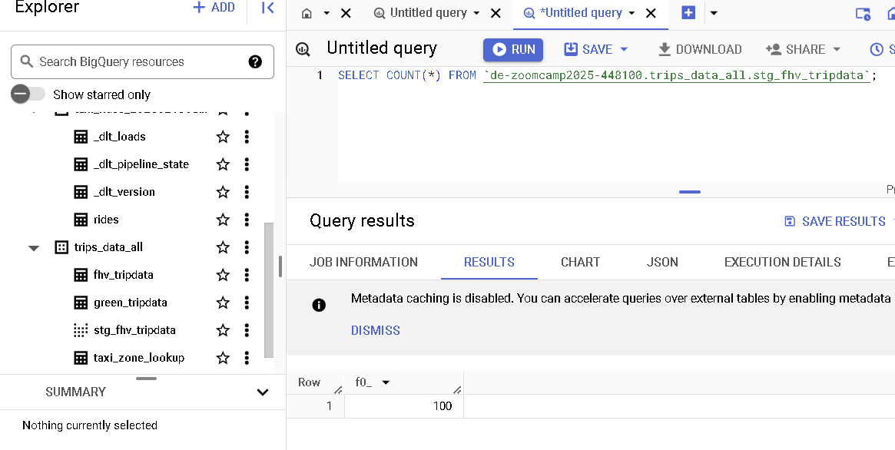
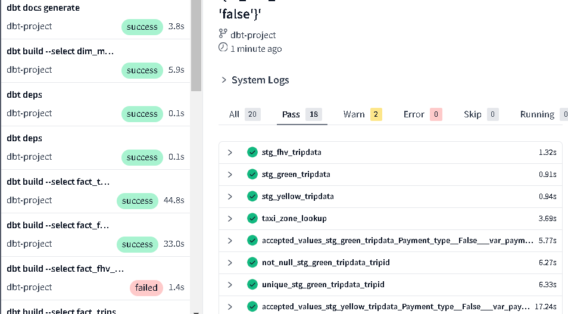
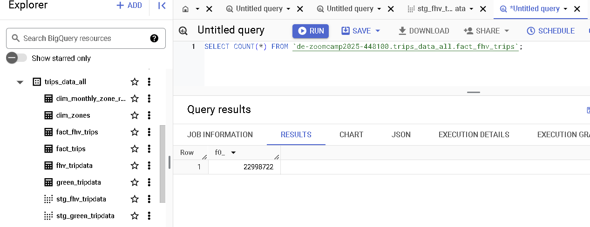
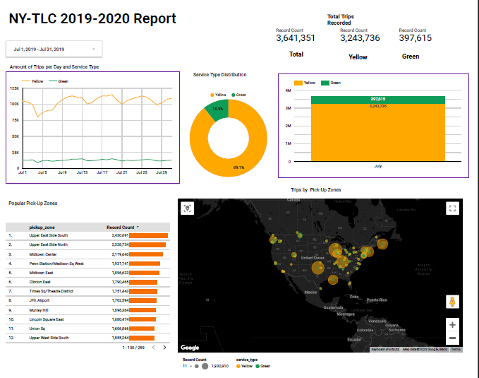
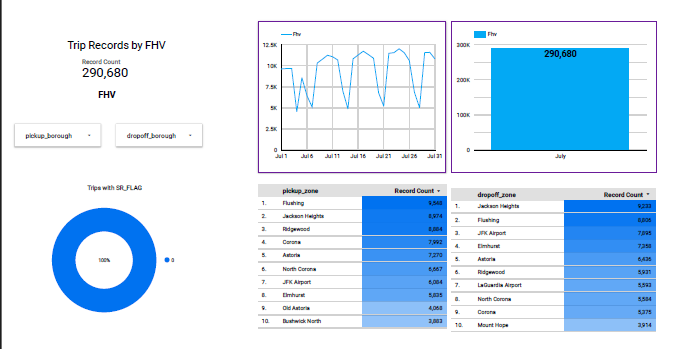
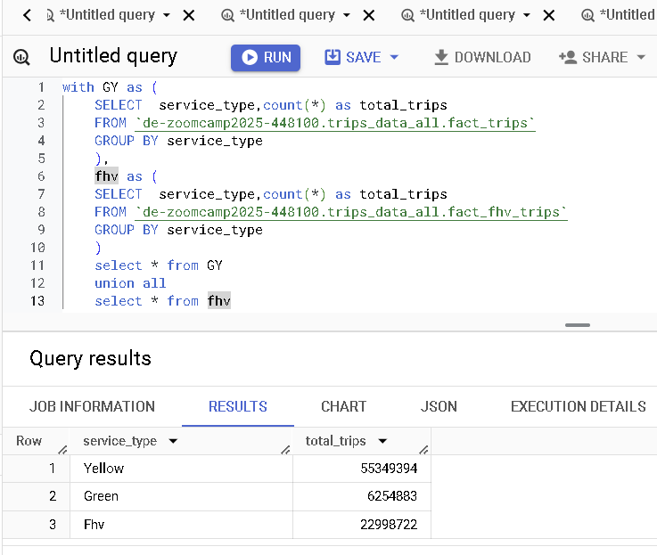
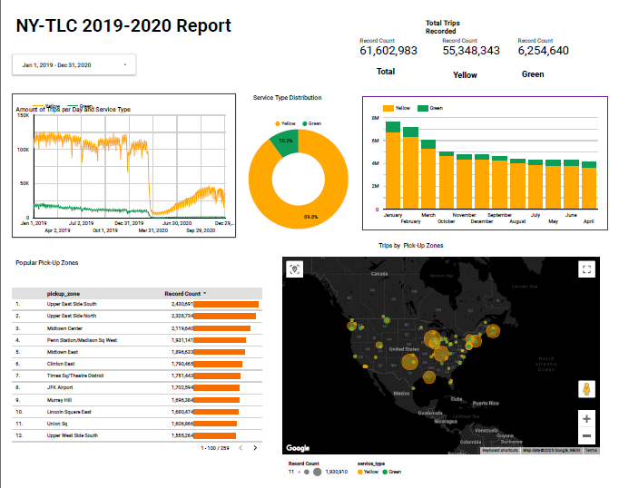
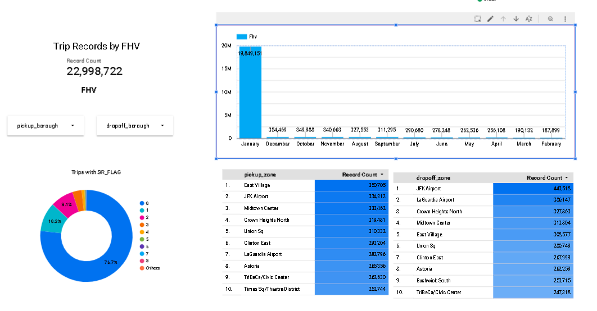

## Module 4 Homework  (DRAFT)

In this homework, we'll use the models developed during the week 4 videos and enhance the already presented dbt project using the already loaded Taxi data for fhv vehicles for year 2019 in our DWH.

This means that in this homework we use the following data [Datasets list](https://github.com/DataTalksClub/nyc-tlc-data/)
* Yellow taxi data - Years 2019 and 2020
* Green taxi data - Years 2019 and 2020 
* fhv data - Year 2019. 

We will use the data loaded for:

* Building a source table: `stg_fhv_tripdata`
* Building a fact table: `fact_fhv_trips`
* Create a dashboard 

If you don't have access to GCP, you can do this locally using the ingested data from your Postgres database
instead. If you have access to GCP, you don't need to do it for local Postgres - only if you want to.

> **Note**: if your answer doesn't match exactly, select the closest option 

### Data was uploaded to bigquery from python script:  data_upload_gcs.py


### Question 1: 

**What happens when we execute dbt build --vars '{'is_test_run':'true'}'**
You'll need to have completed the ["Build the first dbt models"](https://www.youtube.com/watch?v=UVI30Vxzd6c) video. 
- It's the same as running *dbt build*
- It applies a _limit 100_ to all of our models
- It applies a _limit 100_ only to our staging models
- Nothing

### Answer: It applies a _limit 100_ only to our staging models



### Question 2: 

**What is the code that our CI job will run? Where is this code coming from?**  

- The code that has been merged into the main branch
- The code that is behind the creation object on the dbt_cloud_pr_ schema
- The code from any development branch that has been opened based on main
- The code from the development branch we are requesting to merge to main

### Answer: The code from the development branch we are requesting to merge to main.
Explaination: CI job will run when we creates a pull request,  to merge their changes from a feature branch into the main branch (or another branch).The creation of the pull request triggers the CI pipeline. This pipeline consists of a series of automated steps designed to ensure the new code integrates well with the existing codebase.

### Question 3 (2 points)

**What is the count of records in the model fact_fhv_trips after running all dependencies with the test run variable disabled (:false)?**  
Create a staging model for the fhv data, similar to the ones made for yellow and green data. Add an additional filter for keeping only records with pickup time in year 2019.
Do not add a deduplication step. Run this models without limits (is_test_run: false).
### Source: dbt-nytaxi/models/staging/stg_fhv_tripdata.sql**
```
{{
    config(
        materialized='view'
    )
}}

select
    {{ dbt.safe_cast("dispatching_base_num", api.Column.translate_type("string")) }} as dispatchid,
    {{ dbt.safe_cast("PUlocationID", api.Column.translate_type("integer")) }} as pickup_locationid,
    {{ dbt.safe_cast("DOlocationID", api.Column.translate_type("integer")) }} as dropoff_locationid,
    
    -- timestamps
    cast(pickup_datetime as timestamp) as pickup_datetime,
    cast(dropOff_datetime as timestamp) as dropoff_datetime,
    
    -- trip info
    {{ dbt.safe_cast("SR_Flag", api.Column.translate_type("integer")) }} as sr_flag,
    
    
from {{ source('staging','fhv_tripdata') }}
where extract(year from pickup_datetime) = 2019


-- dbt build --select <model_name> --vars '{'is_test_run': 'false'}'


  limit 100


```
## dbt RUN: 
```
dbt build --select stg_fhv_tripdata.sql --vars '{'is_test_run': 'false'}'
```


Create a core model similar to fact trips, but selecting from stg_fhv_tripdata and joining with dim_zones.
Similar to what we've done in fact_trips, keep only records with known pickup and dropoff locations entries for pickup and dropoff locations.
### Source: dbt-nytaxi/models/core/fact_fhv_trips.sql**
```
{{
    config(
        materialized='table'
    )
}}

with fhv_tripdata as (
    select *, 
     'Fhv' as service_type     
    from {{ ref('stg_fhv_tripdata') }}
),
dim_zones as (
    select * from {{ ref('dim_zones') }}
    where borough != 'Unknown'
)
select  
    fhv_tripdata.dispatchid,
    fhv_tripdata.service_type,
    fhv_tripdata.pickup_datetime,    
    fhv_tripdata.pickup_locationid, 
    pickup_zone.borough as pickup_borough,
    pickup_zone.zone as pickup_zone,
    fhv_tripdata.dropoff_datetime, 
    fhv_tripdata.dropoff_locationid,
    dropoff_zone.borough as dropoff_borough, 
    dropoff_zone.zone as dropoff_zone,  
    fhv_tripdata.sr_flag 
from fhv_tripdata
inner join dim_zones as pickup_zone
on fhv_tripdata.pickup_locationid = pickup_zone.locationid
inner join dim_zones as dropoff_zone
on fhv_tripdata.dropoff_locationid = dropoff_zone.locationid
```
Run the dbt model without limits (is_test_run: false).
```
dbt build --select fact_fhv_trips.sql --vars '{'is_test_run': 'false'}'
```
- 12998722
- 22998722
- 32998722
- 42998722
### Answer: -22998722


### Question 4 (2 points)

**What is the service that had the most rides during the month of July 2019 month with the biggest amount of rides after building a tile for the fact_fhv_trips table and the fact_trips tile as seen in the videos?**


### Yellow-Green July trip records


### Fhv July trip records


Create a dashboard with some tiles that you find interesting to explore the data. One tile should show the amount of trips per month, as done in the videos for fact_trips, including the fact_fhv_trips data.

- FHV
- Green
- Yellow
- FHV and Green
### Answer: Yellow

## Total Trips


### Yellow-Green Dashboard


### Fhv Dashboard


## Submitting the solutions

* Form for submitting: https://courses.datatalks.club/de-zoomcamp-2024/homework/hw4

Deadline: 22 February (Thursday), 22:00 CET


## Solution

To be published after deadline
